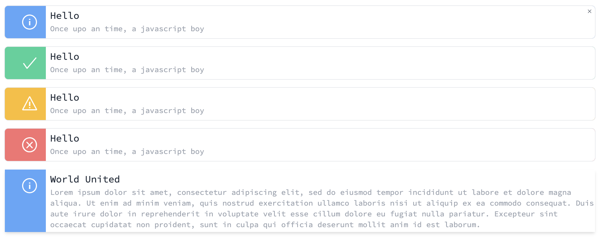

# 1. Alert component spec

Date: 2021-04-14

Deciders: [Miguel Ramos]
Technical Story: [https://github.com/websublime/vitamin/projects/1#card-58059377]
Pull Request: [https://github.com/websublime/vitamin/pull/1]

## Status

2021-04-14 proposed
2021-04-14 done

## Context and Problem Statement

Alert component should have a type to inform user about a system action. This type will be colourful to call user attention. It will exists five types of alert:

- Default, simple with gray
- Success, green color
- Info, blue color
- Warning, yellow or orange color
- Error, red color

Alert should also expose some properties to be more easy to customize. The following table will explain then:

| Property    | Description                                | Value         |
| ----------- | ------------------------------------------ | ------------- |
| hasBorder   | Will make button bordered                  | true or false |
| isClosable  | Should be possible to close alert          | true or false |
| description | Should be possible to assign a description | -             |
| rounded     | Make button from edges rounded to full     | -             |
| shadow      | Make shadow on button                      | -             |
| withMedia   | Prepend an icon to alert                   | true or false |
| title       | Should be possible to assign a title       | -             |
| type        | Type of alert                              | -             |

Component should also expose slots for description, title and media to user costumize for his needed. When closed an event will be emit as 'close'.

## Decision Outcome

Implementation, tests, documentation and example on site.

